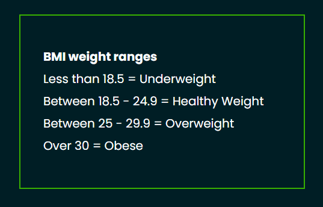

# FITNESS BUDDY

Fitness Buddy is an Fitness App built for convenience. The App enables users to add exercises to a list. Then the user can drag the newly created exercise to a calendar area and drop the exercise in any given day of the week. Also, there is a BMI area where users can calculate their personal BMI. 

# Features

## Exercise List

* Users can create their own exercises list.
* Users can write personal exercises in the input box and add the exercises to a list with click of a button.
* Once the exercise are added to the list, users can drag the newly created exercise to the weekly calendar section.

## Weekly Calendar

* Users are able to drop the new exercises anywhere inside the calendar section.

* Calendar allows users to create personalised exercise routine.

* Full 7 day calendar available for users to customise their workout routine. 

## Subscribe to Newsletter

* Users are able to subscribe to news letter by adding their name and email address in the given fields.

* Once user is subscribed to the list, they will recieve weekly exercising tips sent directly to their email address.

## BMI Calclulator

* Body Mass Index (BMI) allows users to input their weight and height in metrics.

* When the user clicks get results button they will recieve their own BMI based on the weight and height of the users.

* BMI Calculator is a great handy tool to keep track of your Body Mass Index.

## BMI Comparision Chart

* BMI Chart allow users to compare their BMI to see if they are in healthy weight range. 

* Useful chart to compare with the users BMI results. 

# Features Left to Implement

* Email the User their personalised calendar with exercise list to their emaill address.

* Add Calories counter Calculator.

* Create a meal list calendar section so users can create their own healthy meal plans.

## Wireframes

# Deployment

* Fitness Buddy was deployed using GitHub Pages. Below are the steps:

    * Visit Fitness Buddy GitHub Repo
    * Go to Settings
    * Click Pages on left side menu
    * Select Main branch
    * Click Save

# Testing

## W3C Validator

## Errors and Fixes
        
* Error: The value of the for attribute of the label element must be the ID of a non-hidden form control (From line 85, column 17; to line 85, column 36)
* Fix: Updated BMI Form labels with the correct ID's.
* Warning: The type attribute is unnecessary for JavaScript resources.
* Fix: Removed type attribute from EmailJS script tags.

## W3C CSS Jigsaw Validator

* No Errors

## Jshint 

* Errors and Fixes

    * Warnings: Missing semicolons.
    * Fix: Added semicolons in all the lines of code mentioned.
    * Warnings: Unnecessary semicolons.
    * Fix: Removed unnecessary semicolons.

## Responsive Testing

* For Responsive testing Google Devtools was used to minimise the app to view in different device size to create a responsive app.

* Used Media Queries to add styling for different device screen sizes. 

## App Feature Testing

* Exercise List
        
    * Added different exercises to input section and clicked Add button to test the exercises list functionality. 

    * Clicked exercise list remove buttons to ensure each exercises can be deleted by the user. 

    * Dragged exercises away from the list to ensure the exercises list are draggable.

* Calendar Section

    * Exercises items was moved aroubnd the calendar to make sure they are draggables in each calendar day areas.

    * Exercises items remove button clicked to make sure user can remove exercises from the calendar.

    * Tested cloning of exercises to ensure user can clone exercises for better user experience. 

* Subscribe to Newsletter Testing

    * Tested the input of name and user email fields are cleared once the user clicks submit button.

    * Tested user gets an alert notifying them the form was submitted successfully. 

    * Checked EmailJS admin dashboard to ensure the emails are getting sent successfully.

    * Used console log to ensure successful email submission. 

    * Sent dummy emails to myself to ensure the emails are sent properly and the content is correct.

* BMI Calculation Section Testing

    * Tested the weight and height inputs to ensure users are able to add their weight and height.

    * Tested the BMI calculation is correct by using my own weight and height to check my BMI.

    * Added the input information and clicked submit to check the user see the results section with their BMI correctly.

# Credits

* [Gitpod](https://stackoverflow.com/)
* [GitHub](https://github.com/)
* [Google](https://www.google.com/)
* [Google Fonts](https://fonts.google.com/)
* [Stack Overflow](https://stackoverflow.com/)
* [W3Schools](https://www.w3schools.com/)
* [Coolors](https://coolors.co/palettes/trending)
* [Centers for Disease Control and Prevention (BMI Calculation)](https://www.cdc.gov/nccdphp/dnpao/growthcharts/training/bmiage/page5_1.html)
* [Patient (BMI Comparison Information)](https://patient.info/doctor/bmi-calculator-calculator)
* [EmailJS](https://www.emailjs.com/)
* [YouTube](https://www.youtube.com/)
* [IconFinder](https://www.iconfinder.com/search?q=exercise&price=free&license=gte__2)

